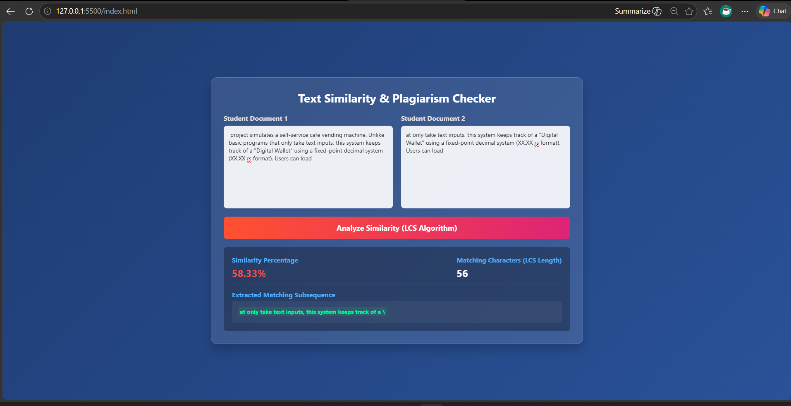

# Text Similarity and Plagiarism Checker

A high-performance web-based tool designed to evaluate document similarity and detect plagiarism. The system processes textual content to extract matching patterns and compute an exact similarity percentage using algorithmic optimization.

## Features

* Real-Time Analysis: Computes text similarity metrics within milliseconds.
* Algorithmic Visualizer: Highlights the exact common subsequences discovered between documents.
* Frameworkless Architecture: Built entirely using lightweight native technologies without enterprise runtime bloat.
* Responsive Layout: Modern glassmorphic dashboard interface compatible across multiple device viewports.

## Tech Stack

* Backend: Java 17 (Utilizing native multi-threaded HttpServer)
* Frontend: HTML5, CSS3 (Modern Glassmorphic UI), and Vanilla JavaScript

## Algorithmic Core: Longest Common Subsequence (LCS)

The underlying computational logic maps text comparison directly to the classic Longest Common Subsequence problem using a Dynamic Programming strategy.

Instead of checking combinations exponentially via brute-force which operates at a heavy time scale, this engine implements a Bottom-Up Tabulation matrix approach. It evaluates subproblems progressively and records matches to achieve an optimal runtime complexity of O(M * N), where M and N represent the lengths of the respective documents. A backtracking mechanism is executed over the computed data grid to precisely extract the continuous matching path of characters for client-side highlighting.

## System Preview

Below is the user interface showing the statistical breakdown panel and similarity metrics after processing input payloads:

## Local Installation and Execution

To run this project locally, ensure you have Java Development Kit (JDK 17 or higher) installed on your operating system.

1. Clone the repository to your environment:
git clone [https://github.com/AnishaArain0/Text-Similarity-Checker.git](https://www.google.com/search?q=https://github.com/AnishaArain0/Text-Similarity-Checker.git)
2. Navigate into the project directory:
cd Text-Similarity-Checker
3. Compile the Java source files:
javac Main.java
4. Execute the native backend server:
java Main
5. Access the application interface:
Simply locate the index.html file in your directory and double-click it to launch the workspace interface inside your web browser. Ensure the backend script is actively running on port 8080 to facilitate real-time requests.

## Author

Developed by A.A.A

Project Repository Link: [https://github.com/AnishaArain0/Text-Similarity-Checker](https://github.com/AnishaArain0/Text-Similarity-Checker)
--
Profile Portfolio: [https://github.com/AnishaArain0](https://github.com/AnishaArain0)
